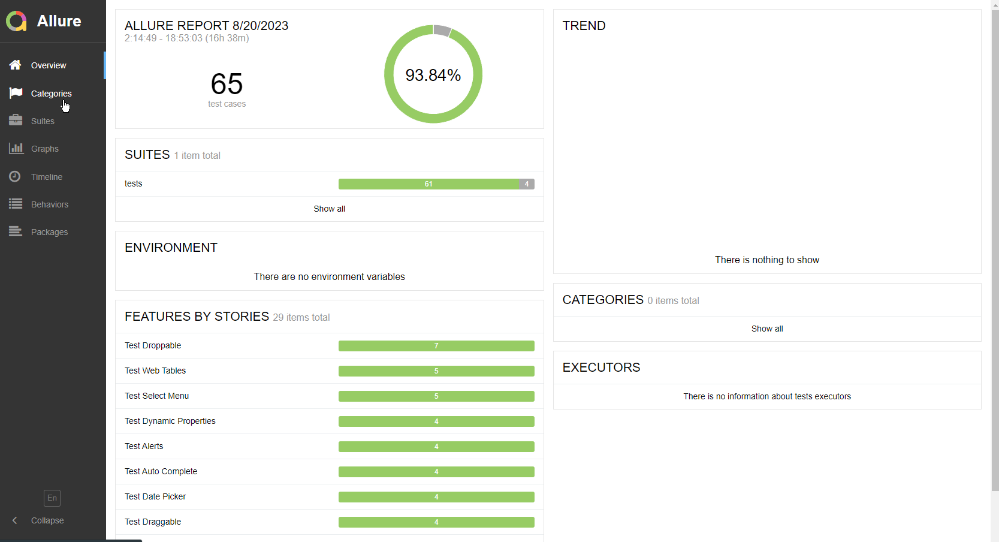

# Test Automation with Pytest+Selenium

1. [Re-test bugs: capital.com](https://github.com/MikeTaran/CapitalReTests)
2. [DemoQA](https://demoqa.com/) : [framework](https://github.com/MikeTaran/PytestSelenium)
   
3. Stepik - Test Automation with Selenium and Python:
   * [final project](https://github.com/MikeTaran/stepikFinalProject)
   * [certificate](https://stepik.org/cert/2139632)

## Tips and Tricks
1. Allure:
    * запуск теста: `pytest --alluredir=./allure_reports .\tests\forms_test.py`
    * формирование отчета: `allure serve .\allure_reports\`
2. Запуск дебагера через 5сек для DevTools: `setTimeout(() => {debugger;}, 5000)`. 
